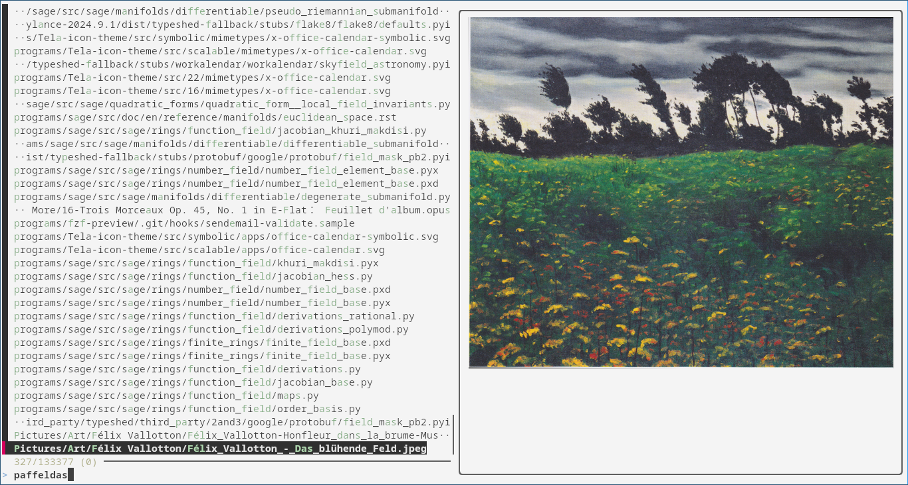

# ***fzf*** with versatile previewing

# Usage
Run the bash script `fzf-preview.sh`.  
This chooses an image viewer and calls `fzf` with preview script `fzf-file2img.sh`.

# Dependencies
`fzf`: [junegunn/fzf](https://github.com/junegunn/fzf)

## Image viewer:  
`ueberzug` (suggested)

Alternatives:  
`chafa`  
`catimg`

Also works within a `kitty` terminal employing `kitty icat`.
