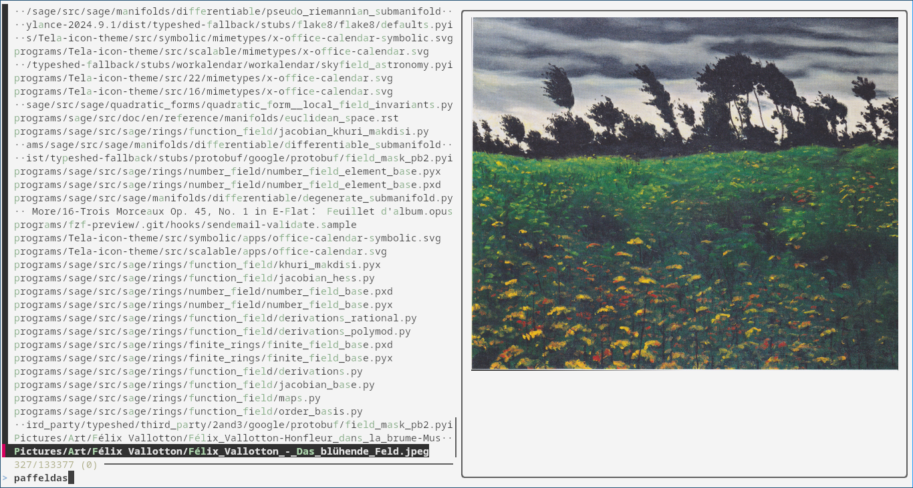

# ***fzf*** with versatile previewing

# Usage
Run the bash script `fzf-preview.sh`.  
This chooses an image viewer and calls `fzf` with preview script `fzf-file2preview.sh`.

# Dependencies
`fzf`: [junegunn/fzf](https://github.com/junegunn/fzf)

This is the only critical dependency. The rest expand functionality and can be
added as needed.

## Image viewer
`ueberzugpp`: [jstkdng/ueberzugpp](https://github.com/jstkdng/ueberzugpp) (suggested)

Alternatives:  
`ueberzug`: [ueber-devel/ueberzug](https://github.com/ueber-devel/ueberzug)  
`chafa`: [hpjansson/chafa](https://github.com/hpjansson/chafa)  
`catimg`: [posva/catimg](https://github.com/posva/catimg)

Also works within a `kitty` terminal employing `kitty icat`.

## File-to-preview converters

### Media
audio: `ffmpeg`, `exiftool`  
video: `ffmpegthumbnailer`

### Documents
djvu: `ddjvu`  
docx: `docx2txt`  
eml (email): `mu`  
epub: `epub-thumbnailer`  
odt: `odt2txt`  
pdf: `pdftoppm`

### Compressed files
bz2: `bzcat`  
gz: `unzip`  
xz: `xzcat`  
zip: `zcat`
