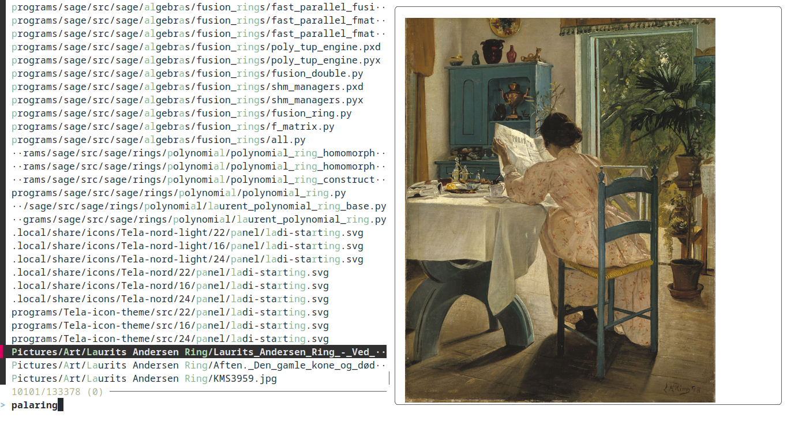

# ***fzf*** with versatile previewing

# Usage
Run the bash script `fzf-preview.sh`.  
This chooses an image viewer and calls `fzf` with preview script `fzf-file2img.sh`.

# Dependencies
`fzf`: [junegunn/fzf](https://github.com/junegunn/fzf)

## Image viewer:  
`ueberzugpp`: [jstkdng/ueberzugpp](https://github.com/jstkdng/ueberzugpp) (suggested)

Alternatives:  
`ueberzug`: [ueber-devel/ueberzug](https://github.com/ueber-devel/ueberzug)  
`chafa`: [hpjansson/chafa](https://github.com/hpjansson/chafa)  
`catimg`: [posva/catimg](https://github.com/posva/catimg)

Also works within a `kitty` terminal employing `kitty icat`.
